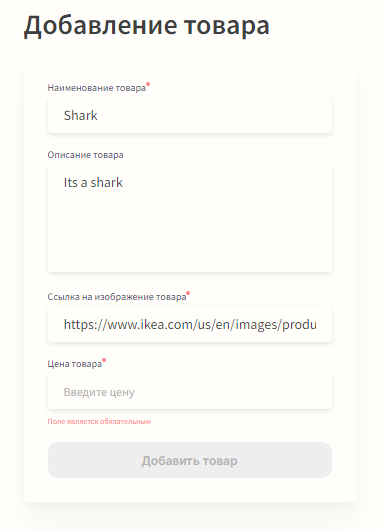
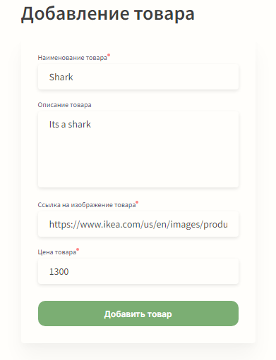
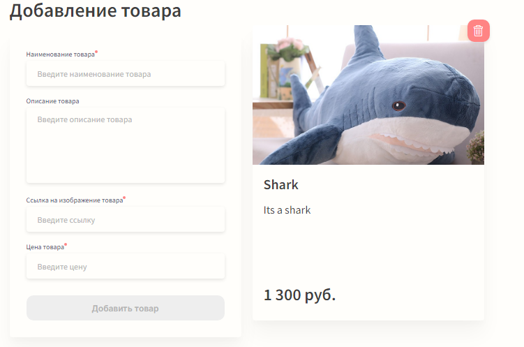
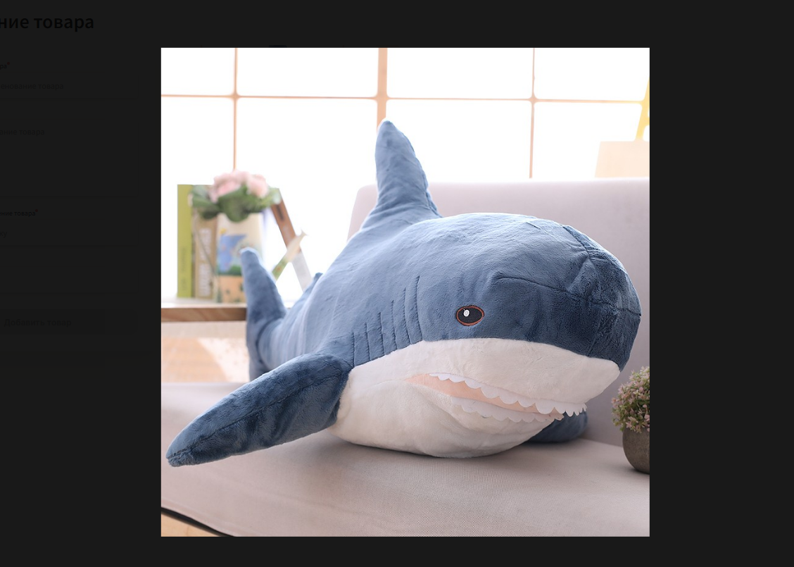
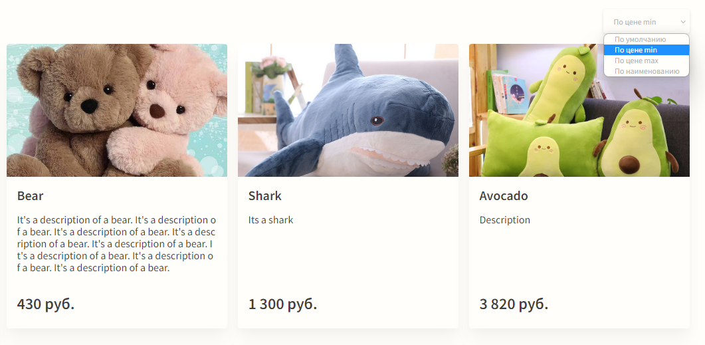

# Product list
Страница вывода списка товаров (изначально список пуст).
https://aslyubavin.github.io/Product-List/

### Форма
Для добавления товара необходимо заполнить форму. Поля "Имя", "Ссылка", "Цена" - обязательные, форма не отправится, пока данные поля пустые. При заполнении всех обязательных полей кнопка становится активной для добавления товара в список.

### Список товаров
Список формируется путем добавления новых товаров через форму.
Данные по товару сохраняются в localStorage, что позволяет сохранять список при обновлении/закрытии страницы браузера.

- Цены отображаются с учетом разделения на разряды (тысячи).
- При наведении курсора мыши на товар появляется иконка удаления данного товара (на малых разрешениях экрана иконка активна всегда). 
- При клике на изображение товара открывается полное изображение.

### Сортировка
Меню сортировки позволяет сортировать товары в списке:
- по возрастанию цены;
- по убыванию цены;
- по наименованию;
- дефолтное значение;

